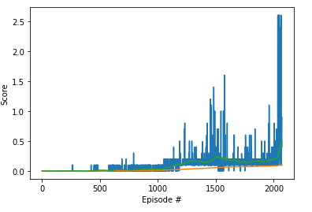

[//]: # (Image References)

[image1]: https://user-images.githubusercontent.com/10624937/42135623-e770e354-7d12-11e8-998d-29fc74429ca2.gif "Trained Agent"
[image2]: https://user-images.githubusercontent.com/10624937/42135622-e55fb586-7d12-11e8-8a54-3c31da15a90a.gif "Soccer"

# Project 3: Collaboration and Competition

### Introduction

For this project, you will work with the [Tennis](https://github.com/Unity-Technologies/ml-agents/blob/master/docs/Learning-Environment-Examples.md#tennis) environment.

![Trained Agent][image1]

In this environment, two agents control rackets to bounce a ball over a net. If an agent hits the ball over the net, it receives a reward of +0.1.  If an agent lets a ball hit the ground or hits the ball out of bounds, it receives a reward of -0.01.  Thus, the goal of each agent is to keep the ball in play.

The observation space consists of 8 variables corresponding to the position and velocity of the ball and racket. Each agent receives its own, local observation.  Two continuous actions are available, corresponding to movement toward (or away from) the net, and jumping. 

The task is episodic, and in order to solve the environment, your agents must get an average score of +0.5 (over 100 consecutive episodes, after taking the maximum over both agents). Specifically,

### Solution

To be able to solve the environment, I have implemented DDPG based multi agent using the code in the preivous project. The state information is shared for both agents and two agents trained simultaniously. Since the state information is shared the replay buffer is same for both agents. Following is the result of the training after 1737 episodes. Agents were able to reach avarege score of 0.5 in average on last 100 episodes. Blues line shows the score achived by the agent, orange is the overall average score and the green line is the avarage of last 100 episodes.

Video of the agent playing the game can be found [here](./demo2.wmv)

The report of the project is available in [here](./report.pdf) 